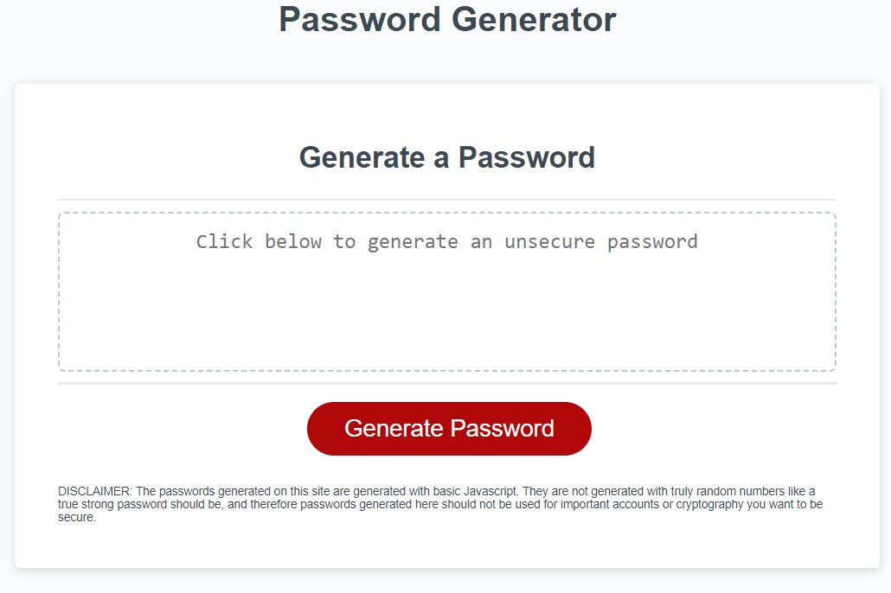

# Password Generator

## Description

- This site generates passwords to a specified length by the user(between 8 and 128 in length) and will generate passwords from the following character groups:

-- Lower Case Letters

-- Upper Case Letters

-- Special CHaracters

-- Numbers

- The user is able to chose from any/all of these groups, and the user must choose at least one group.

- With this project I was excited to put the knowledge with JS I've learned so far into use. I was feeling quite confident after the first intro to JS week, JS definitely seems more logical than CSS.

-I learned that its somehwat easier to build all the components necessary step by step, in bite sized peices, one thing at a time. Doing this was easier for me to manage, as the last project I was much more scattered and it took much more time and effort to complete than this one.

-I also learned how useful stackexchange is! There were a few things I was uncertain about, as well as some things i didnt quite know how to accomplish, but with google and websites like stackexchange, w3 schools, mozilla MDN documentation etc I was able to figure out quite a lot. The most helpful of these to me for this project I have included in the credits section.

## Usage

Link to the deployed application:

[Application](https://jrapich.github.io/password-generator/)

Link to the repo containing the code for this application:
[Repository](https://github.com/jrapich/password-generator)

Usage is simple. Click the  generate button, follow the prompts to determine the length of the password and which character groups the password will be generated from. If any are entered incorrectly or if an incorrecct value is entered, the page will alert the user. 

DISCLAIMER: The passwords generated on this site are generated with basic Javascript coded by a beginner. They are not generated with truly random numbers(like /dev/random or similar methods) like a true strong password should be, and therefore passwords generated here should not be used for important accounts or cryptography you want to be secure. Basically the passwords here are not generated from a truly random seed, and might be predictable/breakable if an adversory learns a password was generated with this site.
Use caution! This should be intended as a proof of concept tool and not something you should rely on for cryptographic security.

## Screenshot 

Here is a screenshot of the deployed site:

## Credits

Original source code this project was based on is located here:
https://github.com/coding-boot-camp/friendly-parakeet

This site hepled me extensively with generating the needed random numbers:
https://www.w3schools.com/JS/js_random.asp

this helped me set up the git in the beginning, i did it backwards:
https://superuser.com/questions/1412078/bring-a-local-folder-to-remote-git-repo

Useful list of js array methods I frequently referenced:
https://www.w3schools.com/js/js_array_methods.asp

As well as js string methods:
https://www.w3schools.com/js/js_string_methods.asp

This helped me figure out how to store a for loop result to an array:
https://stackoverflow.com/questions/11455430/javascript-storing-for-loop-result

This taught me how to convert a user entry of a prompt() to a number because prompt() returns only strings:
https://stackoverflow.com/questions/17907455/how-to-get-numeric-value-from-a-prompt-box

this was a good reference for me for truthy conditionals
https://developer.mozilla.org/en-US/docs/Glossary/Truthy

## License

This project and code protected under MIT license. For more info, see ./LICENSE

---